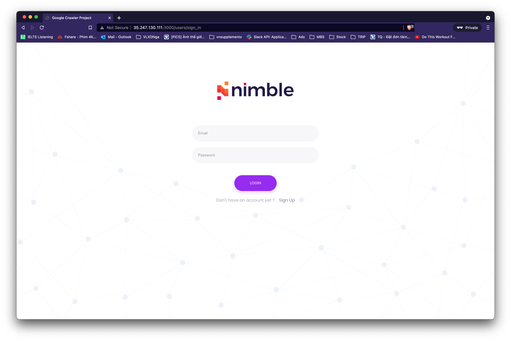

## Overview
This web application GCRP will extract large amounts of data from the Google search results page.
This version only supports uploading csv file, with one keyword per line. Download example file below.

## System Dependencies
- Ruby 2.6.2
- Rails 5.2.6
- PostgreSQL
- Google Cloud Storage
- Sidekiq
- Redis
## Setup & Configuration
# Manual
1. Install PostgreSQL
```sh
brew install postgresql
```
2. Install Ruby 2.6.2 (recommend use rvm)
3. Install Geckodriver
4. Clone project
```sh
git clone git@github.com:tamle-dev/google-crawler.git
```
5. Duplicate .env from .env.example
6. Add Google Cloud Credential to config/secrets.yml
7. Install dependencies
```sh
bundle install
```
8. Create database
```sh
rake db:create
```
9. Migrations and Seed data
```sh
rake db:migrate
rake db:seed
```
10. Start application
```sh
rails c
```
10. Access http://localhost:3000
# Docker
1. Clone project
```sh
git clone git@github.com:tamle-dev/google-crawler.git
```
2. Duplicate .env from .env.example
3. Add Google Cloud Credential to config/secrets.yml
4. Build image
```sh
docker build . -t tamle:lasted
```
5. Compose container
```sh
docker-compose up -d
```
6. Access http://localhost:3000
## API
1. Login with email & password
```sh
POST api/v1/users/login
```
2. Upload keywords csv file which want to extract
```sh
POST api/v1/attachments
```
3. Get keywords
```sh
GET api/v1/keywords
```
4. Get keyword details
```sh
GET api/v1/keyword/:id
```
## How to use on GCRP?
1. Access http://localhost:3000
2. Sign in / Sign up
3. Upload file csv
4. View list of keywords
5. View the search result information for each keyword.
## UI

